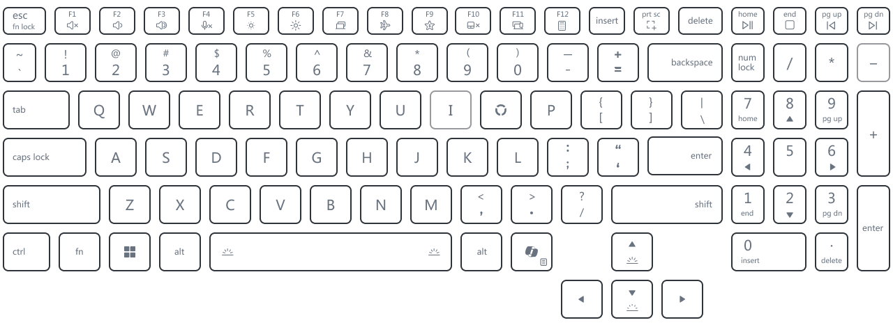

# Lenovo 24-Zone RGB Controller (Linux Port)

[](https://github.com/JVN321/LOQ-24-zone-RGB-controller)

A lightweight, native high-performance Linux daemon and web controller for managing **24 independent RGB zones** on Lenovo LOQ laptops. Driven by a native Rust backend with direct USB HID control and a glassmorphic Axum web interface.

---

## Quick Start & Installation

### Option A: Automated 1-Step Installer (Recommended)

Run the installer script — it automatically detects your Linux distribution (Arch, Fedora, Debian/Ubuntu), installs required system packages, sets up udev hardware permissions, compiles the workspace, and enables the systemd daemon:

```bash
git clone https://github.com/JVN321/LOQ-24-zone-RGB-controller.git
cd LOQ-24-zone-RGB-controller
./install.sh
```

Open your browser at **[http://127.0.0.1:7070](http://127.0.0.1:7070)**.

---

### Option B: Manual Installation

#### 1. Install System Dependencies

Select your Linux distribution to install required dependencies (HID drivers, PipeWire audio, Wayland/X11, Clang compiler):

#### Arch Linux
```bash
sudo pacman -S --needed \
    alsa-lib \
    libx11 \
    libxi \
    libxrandr \
    hidapi \
    pkgconf \
    base-devel \
    clang \
    wayland \
    libxkbcommon \
    mesa \
    pipewire \
    dbus \
    grim
```

#### Fedora (Workstation / Silverblue / Kinoite)
```bash
sudo dnf install -y \
    alsa-lib-devel \
    libX11-devel \
    libXi-devel \
    libXrandr-devel \
    hidapi-devel \
    pkgconf-pkg-config \
    gcc \
    wayland-devel \
    libxkbcommon-devel \
    mesa-libEGL-devel \
    mesa-libgbm-devel \
    pipewire-devel \
    dbus-devel \
    clang \
    grim
```

#### Debian / Ubuntu
```bash
sudo apt-get update && sudo apt-get install -y \
    libasound2-dev \
    libx11-dev \
    libxi-dev \
    libxrandr-dev \
    libhidapi-dev \
    pkg-config \
    build-essential \
    libwayland-dev \
    libxkbcommon-dev \
    libegl1-mesa-dev \
    libgbm-dev \
    libpipewire-0.3-dev \
    libdbus-1-dev \
    clang \
    grim
```

---

### 2. Configure Hardware Permissions (udev)

Allow non-root access to the USB HID keyboard controller:

```bash
# 1. Copy the udev rule
sudo cp 99-loq-rgb.rules /etc/udev/rules.d/

# 2. Reload and trigger udev rules
sudo udevadm control --reload-rules
sudo udevadm trigger

# 3. Add your user to input and plugdev groups
sudo usermod -aG input $USER
sudo usermod -aG plugdev $USER

# Log out and log back in (or run 'newgrp input')
```

---

### 3. Build & Run

```bash
# 1. Compile the Rust workspace
./build.sh

# 2. Start the controller daemon
./target/release/rgb-server

# 3. Open the Web UI in your browser
# Navigate to: http://127.0.0.1:7070
```

---

### 4. Enable Startup Service (systemd)

To automatically launch the RGB controller daemon on user login:

```bash
# 1. Install binary and wrapper script
mkdir -p ~/.local/bin
cp target/release/rgb-server ~/.local/bin/

# 2. Install user systemd service
mkdir -p ~/.config/systemd/user
cp rgb-controller.service ~/.config/systemd/user/

# 3. Enable and start the service
systemctl --user daemon-reload
systemctl --user enable rgb-controller.service
systemctl --user start rgb-controller.service
```

**Service Management Commands:**
```bash
# Check service status
systemctl --user status rgb-controller.service

# View live logging output
journalctl --user -u rgb-controller.service -f

# Restart daemon service
systemctl --user restart rgb-controller.service
```

---

## Keyboard Zone Layout

The Lenovo LOQ keyboard features 24 physical RGB zones across the keyboard:



---

## Features & Supported Effects

- **24 Granular RGB Zones:** Independent color and animation control per zone.
- **High Performance:** Low-latency updates up to 60 FPS driven directly by Rust.
- **Favorites & Preset Cycle:** Star your favorite lighting presets in the Web UI and cycle through them globally using a custom assignable hotkey (Default: `Alt+P`).
- **Direct USB HID Control:** Native LampArray protocol communication with zero bloatware.

### Available Lighting Presets

| Category | Presets |
|---|---|
| **Dynamic & Ambient** | Rainbow Wave, Rainbow Cycle, Rainbow Breath, Color Wheel, Color Sweep, Color Scan, Aurora, Nebula, Sparkle, Chromatic Breath, Breathing, Pulse, Ferrari RPM |
| **System & Hardware** | CPU-Mem-GPU Thermal Status, Screen Ambiance *(Wayland/X11 Screen Capture)* |
| **Audio Reactive** | Audio Sparkle, Audio Sparkle Rainbow, Audio Sparkle Media, Audio Ripple *(PipeWire Loopback)* |
| **Typing Reactive** | Typing Rainbow Ripple, Keyboard Wave *(Water ripple physics on keypress)* |
| **Custom & Layering** | Interactive 24-Zone Static Color Palette, Multi-Effect Layering with opacity & priority stacking |

---

## Troubleshooting & Recovery

### 1. What is Autonomous Mode?
Under the Microsoft HID LampArray specification, **Autonomous Mode** (Report ID `0x06`) toggles LED control authority:
- **Enabled (`0x01`)**: The keyboard's internal firmware plays built-in hardware color waves.
- **Disabled (`0x00`)**: The firmware halts built-in animations and surrenders full control to `rgb-server` for custom per-zone frame updates (Reports `0x04`/`0x05`).

### 2. Microcontroller Recovery from Upgrade Mode (`048d:89db`)
If the ITE Tech keyboard controller receives malformed or unpadded packets, it may crash into fallback bootloader mode (`048d:89db ITE Upgrade Mode` in `lsusb`).

Because USB VBUS standby lines remain powered even during soft reboots, the chip stays in bootloader mode. To reset back to Normal Mode (`048d:c693`):
1. **Shut down the laptop completely.**
2. **Unplug the power adapter for 5–10 seconds** to completely discharge motherboard standby capacitors.
3. **Power back on.** The keyboard controller cold-boots back into normal mode, and `rgb-server` takes host control.

---

## Architecture Overview

- **Frontend (UI):** Embedded HTML5/CSS3/JS page (`rgb-server/static/index.html`) using WebSockets and REST API for real-time visualization and settings management.
- **Server:** `rgb-server/` — Axum web server hosting REST endpoints and WebSocket frame broadcast hubs.
- **Backend (Rust):** `rust-backend/` — Core Rust crate managing HID hardware drivers, PipeWire audio samplers, evdev hotkeys, and preset modules.

---

## Creating Custom Effects

You can implement customized static or dynamic effects using Rust:

1. Create a new file under `rust-backend/src/presets/` (e.g., `my_custom_effect.rs`) implementing the `Effect` trait.
2. Expose your module in `rust-backend/src/presets/mod.rs`:
   ```rust
   pub mod my_custom_effect;
   ```
3. Add your `PresetMetadata` config block inside `get_available_presets()` in `presets/mod.rs`.
4. Hook your constructor into `build_effect_inner` in `rust-backend/src/lib.rs`.

---

## Credits & Acknowledgments

This project was initially based on and ported from the original Windows version by [DChitale](https://github.com/DChitale):
- **Original Windows Repository:** [DChitale/LOQ-24-zone-RGB-controller](https://github.com/DChitale/LOQ-24-zone-RGB-controller)

It was subsequently completely remade into a high-performance Linux native daemon and web interface. Special thanks to [DChitale](https://github.com/DChitale) for laying the initial groundwork for Lenovo LOQ 24-zone RGB keyboard control!

---

## License

This project is licensed under the [MIT License](LICENSE).
