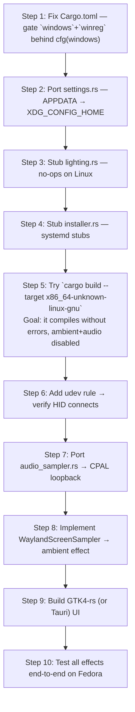

# Linux (Fedora) Migration Plan — LOQ 24-Zone RGB Controller

## Executive Summary

The project is split into two halves:

| Component | Current Stack | Linux Situation |
|---|---|---|
| **Rust backend** (`rust-backend/`) | `cdylib` → `rgb_backend.dll` | **Mostly portable** — 3 hard Windows deps need surgery |
| **C# frontend** (`RGBController/`) | WinForms / .NET 8-windows | **Cannot run on Linux** — needs a full rewrite |

The Rust backend does ~95% of the work (HID hardware control, all effects, FFI API). The frontend is purely a thin UI shell. The strategy is:

1. Port the Rust backend to compile and run natively on Linux
2. Replace the WinForms UI with a native Linux GUI (recommended: GTK4 via Rust, or a simple web-based UI)

---

## Part 1 — Rust Backend: What Needs to Change

### 1.1 Windows-Only Dependency: `windows` crate

**Files affected:** `Cargo.toml`, `audio_sampler.rs`, `ambient.rs`

The `windows = "0.52"` crate in `Cargo.toml` is a hard Windows API binding. It is used in two places:

#### A. `audio_sampler.rs` — WASAPI loopback audio capture

The entire file uses `windows::Win32::Media::Audio::*` (WASAPI COM interfaces) to capture system audio output for audio-reactive effects (`AudioSparkle`, `AudioRipple`, etc.).

**Linux replacement:** Use [CPAL](https://github.com/RustAudio/cpal) — already in `Cargo.toml` as `cpal = "0.15"` but currently unused in this context. CPAL supports **PipeWire / PulseAudio loopback** on Linux. You'll rewrite `AudioSampler` to use CPAL's loopback input stream.

> [!IMPORTANT]
> On Fedora, loopback monitoring requires a PulseAudio/PipeWire monitor source. CPAL can enumerate these directly. The user may need to ensure a monitor device exists (usually auto-created by PipeWire).

**Plan:**
```rust
// Replace WASAPI capture loop with CPAL:
use cpal::traits::{DeviceTrait, HostTrait, StreamTrait};

// Find monitor (loopback) device — on PulseAudio/PipeWire this is
// the ".monitor" input device for the default output.
let host = cpal::default_host();
let input_device = host.default_input_device(); // or enumerate for "Monitor"
```

#### B. `ambient.rs` — DXGI screen capture (the `DxgiScreenSampler`)

The `ambient` preset uses `DirectX DXGI OutputDuplication` to capture the screen. This is 100% Windows-exclusive.

**Linux replacement:** Use [scap](https://github.com/ScreenCapture/scap) or write a custom **PipeWire screen capture** using `libpipewire` / the `ashpd` portal crate (for Wayland). For X11 it's simpler (just `XShmGetImage`).

Since Fedora defaults to **Wayland**, the recommended path:
- Use the [`ashpd`](https://crates.io/crates/ashpd) crate (XDG Desktop Portal) to open a screen capture session
- Read frames via PipeWire SPA buffers

**Fallback:** If you want a simpler approach first, use the [`scap`](https://crates.io/crates/scap) crate which abstracts over Wayland (portal) / X11 for you.

The `ScreenSampler` trait in `ambient.rs` is already abstract — you only need to implement it for a new `WaylandScreenSampler` struct.

> [!NOTE]
> Because this feature requires portal permissions, the user will see a one-time screen-share prompt from GNOME.

#### C. `lighting.rs` — Windows Dynamic Lighting registry + PowerShell

This whole module manipulates `HKCU\Software\Microsoft\Lighting` via PowerShell. **This concept does not exist on Linux.**

On Linux, conflicting RGB control is handled differently — there's no "Dynamic Lighting" system. The equivalent concern (another service overriding the keyboard) is avoided by running `openrgb --noautoconnect` or similar.

**Plan:** Stub out all functions to no-ops. The feature simply doesn't apply.

```rust
// lighting.rs — Linux stub
pub fn enable_windows_lighting() -> Result<(), Box<dyn std::error::Error>> { Ok(()) }
pub fn disable_windows_lighting() -> Result<(), Box<dyn std::error::Error>> { Ok(()) }
pub fn is_windows_lighting_enabled() -> bool { false }
pub fn set_windows_lighting_on_top() -> Result<(), Box<dyn std::error::Error>> { Ok(()) }
```

#### D. `installer.rs` — Windows Task Scheduler + `%APPDATA%` + PowerShell

Uses `schtasks`, `APPDATA` env var, `CREATE_NO_WINDOW` flag, and `schtasks /query`.

**Plan:** Replace with a **systemd user service** (`~/.config/systemd/user/`). The installer functions can generate and install/remove a `.service` file and call `systemctl --user enable`.

```rust
// Linux equivalent for create_startup_task:
// Write ~/.config/systemd/user/loq-rgb.service
// Run: systemctl --user enable loq-rgb.service
```

#### E. `settings.rs` — `APPDATA` environment variable

```rust
let appdata = std::env::var("APPDATA")?; // Windows-only env var
```

**Plan:** Replace with XDG config directory.

```rust
// Linux equivalent:
use std::path::PathBuf;

fn get_settings_path() -> Result<PathBuf, Box<dyn std::error::Error>> {
    let config_dir = std::env::var("XDG_CONFIG_HOME")
        .map(PathBuf::from)
        .unwrap_or_else(|_| {
            let home = std::env::var("HOME").expect("HOME not set");
            PathBuf::from(home).join(".config")
        });
    let app_dir = config_dir.join("loq-rgb");
    std::fs::create_dir_all(&app_dir)?;
    Ok(app_dir.join("settings.json"))
}
```

#### F. `lib.rs` — Windows command flags + `CommandExt`

The `lighting.rs` / `installer.rs` use `use std::os::windows::process::CommandExt` and `.creation_flags(CREATE_NO_WINDOW)`. Gate these with `#[cfg(windows)]`.

#### G. `winreg = "0.52"` in `Cargo.toml`

**Used nowhere in current source** (registry access goes through PowerShell scripts in `lighting.rs`). Safe to remove or gate with `#[cfg(windows)]`.

---

### 1.2 HID Access on Linux — Permissions

The `hidapi` crate works on Linux but **requires udev rules** to allow non-root HID access.

**Required action:** Create a udev rule file.

```ini
# /etc/udev/rules.d/99-loq-rgb.rules
SUBSYSTEM=="hidraw", ATTRS{idVendor}=="048d", ATTRS{idProduct}=="c693", MODE="0660", GROUP="plugdev", TAG+="udev-acl"
```

After placing the file:
```bash
sudo udevadm control --reload-rules
sudo udevadm trigger
# Add your user to plugdev group:
sudo usermod -aG plugdev $USER
# Log out and back in
```

> [!CAUTION]
> Without this udev rule, the Rust backend will silently fail to connect (`rgb_init()` returns 1 but `is_connected()` returns false). Always verify udev rules before debugging HID issues.

---

### 1.3 Global Hotkey — `rdev` crate

The `rdev = "0.5"` crate (used in `input_handler.rs`) works on Linux but requires **X11 or Wayland XDP** access. On Wayland (Fedora default), global key listening without root is restricted.

**Options:**
- Run as a service or use `xdg-input-method` / `evdev` for global hotkeys
- Or fallback to local (window-focused) hotkeys only
- The `rdev` crate itself claims Wayland support but may need `DISPLAY` or `WAYLAND_DISPLAY` to be set

> [!NOTE]
> For typing-reactive effects, `rdev` listens on all key events. On Wayland this may require the app to have access to `/dev/input/` or to run with appropriate capabilities. On Fedora with SELinux, you may need a custom policy or use X11 mode via `XWayland`.

---

### 1.4 `sysinfo` and `nvml-wrapper` — Cross-platform Concerns

- `sysinfo = "0.38"` — ✅ Fully cross-platform, works on Linux. Used in `thermalStatus.rs` for CPU/RAM metrics.
- `nvml-wrapper = "0.11"` — ✅ Works on Linux if NVIDIA drivers are installed. Used in `thermalStatus.rs` / `rpm.rs` for GPU metrics. Requires `libnvidia-ml.so` to be present (installed with NVIDIA drivers).

On Fedora with an NVIDIA card, `nvml-wrapper` will work fine if you have the NVIDIA driver from RPM Fusion or official repos.

---

### 1.5 Summary Table — Rust Backend Changes

| File | Issue | Action |
|---|---|---|
| `Cargo.toml` | `windows` crate, `winreg` | Make `windows` and `winreg` `cfg(windows)` only; add `ashpd`/`scap` for ambient |
| `audio_sampler.rs` | WASAPI (Win-only) | Rewrite using CPAL loopback input for PipeWire/PulseAudio |
| `ambient.rs` | DXGI (Win-only) | Implement `WaylandScreenSampler` using `scap` or `ashpd`+PipeWire |
| `lighting.rs` | PowerShell + Win registry | Stub to no-ops (`Ok(())` / `false`) |
| `installer.rs` | `schtasks`, `APPDATA`, PowerShell | Rewrite using `systemd --user` + `XDG_CONFIG_HOME` |
| `settings.rs` | `APPDATA` env var | Replace with `XDG_CONFIG_HOME` / `~/.config` |
| `lib.rs` | Win-specific startup calls | Gate `lighting::` / `installer::` calls with `#[cfg(windows)]` |
| System | HID access | Add udev rule for VID 048d / PID c693 |
| System | Global hotkeys (rdev) | Test on Wayland; may need XWayland fallback |

---

## Part 2 — Frontend: Replacing WinForms

### 2.1 Why WinForms Cannot Run on Linux

The `RGBController.csproj` targets `net8.0-windows` with `<UseWindowsForms>true`. WinForms is Windows-exclusive — there is no Linux implementation. The UI must be completely rewritten.

The frontend is a **thin shell** that:
1. Loads `rgb_backend.dll` via P/Invoke (FFI)
2. Shows a keyboard zone visualization canvas
3. Lets the user pick presets + adjust parameters
4. Reads the brightness slider
5. Shows system tray icon

### 2.2 Recommended Replacement Options

#### Option A (Recommended): Pure Rust GTK4 UI

Replace the C# frontend with a Rust GTK4 app using [`gtk4-rs`](https://gtk4-rs.github.io/).

**Pros:**
- Native Fedora look (GTK4 is the GNOME default)
- No FFI layer needed — the UI crate links directly to the backend library code
- Single language, single build system
- System tray via `libadwaita` + Status Icon / `libayatana-appindicator`

**Approach:**
```
New crate: rgb-ui (binary)
Depends on: rgb-backend (as a library, not a DLL)
```

The backend lib exposes `pub fn rgb_init()`, `pub fn rgb_set_preset(...)`, etc. — the UI can call these directly instead of via FFI.

**Key GTK4-rs widgets needed:**
- `DrawingArea` — for the 24-zone keyboard visualization (replaces Win2D canvas)
- `Scale` — brightness slider
- `ListBox` / `DropDown` — preset selector
- `ColorButton` — color picker for parametric effects
- `gio::Application` with `StatusIcon` — system tray

#### Option B: Tauri v2 (Rust + Web UI)

Use [Tauri](https://tauri.app/) with a Web-based UI (HTML/CSS/JS or React). Tauri uses a WebView backend (WebKitGTK on Linux). The Rust backend code would be restructured as Tauri commands.

**Pros:** Easier to make it look beautiful quickly. Very flexible.

**Cons:** Heavier (WebKit dependency), slightly more complex FFI restructuring.

#### Option C: Iced (Pure Rust, Cross-platform)

[`iced`](https://iced.rs/) is a pure-Rust GUI framework inspired by Elm. No GTK dependency. Good for custom UI.

**Cons:** Less mature than GTK4-rs for complex UIs, system tray support limited.

#### Option D: Keep C# with Avalonia

Use [Avalonia UI](https://avaloniaui.net/) instead of WinForms. Avalonia is cross-platform .NET UI that targets Linux/Mac/Windows. The P/Invoke FFI layer in `RgbInterop.cs` would remain intact but load `librb_backend.so` instead of `.dll`.

**Pros:** Closest to a "port" of the existing code — you can reuse most C# UI logic.
**Cons:** Still a .NET dependency on Linux; Avalonia has its own learning curve.

> [!TIP]
> **Recommended path:** Option A (GTK4-rs) for a native Fedora feel with minimum dependency footprint, or Option B (Tauri) if you want to reuse the existing UI designs quickly.

---

### 2.3 DLL → Shared Library Name Change

On Linux, the compiled Rust `cdylib` becomes `librb_backend.so` (not `.dll`).

In `RgbInterop.cs`, the DLL name needs to be conditional:
```csharp
// If keeping C# (Avalonia):
#if WINDOWS
    private const string DllName = "rgb_backend.dll";
#else
    private const string DllName = "librb_backend"; // .NET appends .so automatically
#endif
```

In the Rust frontend option, this is a non-issue since you link directly.

---

## Part 3 — Build System

### 3.1 Replace `build.ps1` with a Shell Script

```bash
#!/usr/bin/env bash
set -e

echo "1/2. Building Rust backend..."
cd rust-backend
cargo build --release
cd ..

echo "2/2. Building GTK4 UI (or: dotnet build for Avalonia)..."
# For GTK4-rs:
cargo build --release --manifest-path rgb-ui/Cargo.toml

echo "Done! Run: ./target/release/rgb-ui"
```

### 3.2 Fedora System Dependencies

Install these before building:

```bash
# HID + build essentials
sudo dnf install -y hidapi-devel pkgconf-pkg-config gcc

# GTK4 (if using GTK4-rs frontend)
sudo dnf install -y gtk4-devel libadwaita-devel

# PipeWire / PulseAudio dev headers (for CPAL loopback audio)
sudo dnf install -y pipewire-devel alsa-lib-devel

# (Optional) For Tauri frontend
sudo dnf install -y webkit2gtk4.0-devel

# Rust toolchain
curl --proto '=https' --tlsv1.2 -sSf https://sh.rustup.rs | sh
```

---

## Part 4 — Recommended Implementation Order



### Step-by-Step Breakdown

#### Step 1 — Gate Windows-Only Cargo Dependencies

In `Cargo.toml`:
```toml
[target.'cfg(windows)'.dependencies]
windows = { version = "0.52", features = [...] }
winreg = "0.52"

[target.'cfg(target_os = "linux")'.dependencies]
ashpd = "0.9"        # For Wayland screen capture portal
scap = "0.2"         # Optional: easier screen capture abstraction
```

`cpal`, `hidapi`, `sysinfo`, `rdev`, `nvml-wrapper`, `tokio`, `serde`, `once_cell`, `rand`, `anyhow` are all already cross-platform — leave them as is.

#### Step 2 — Fix `settings.rs`

Replace `APPDATA` with XDG path (see code in section 1.5 above).

#### Step 3 — Stub `lighting.rs`

Add `#[cfg(not(target_os = "windows"))]` stubs that return `Ok(())` / `false`. Remove all PowerShell command invocations. Remove `use std::os::windows::process::CommandExt` behind `#[cfg(windows)]`.

#### Step 4 — Stub `installer.rs`

The startup task concept maps to systemd user services on Linux:

```rust
#[cfg(target_os = "linux")]
pub fn create_startup_task(_delay: u32) -> Result<(), Box<dyn std::error::Error>> {
    let service = "[Unit]\nDescription=LOQ RGB startup fix\n\n[Service]\nType=oneshot\nExecStart=/usr/local/bin/loq-rgb --fix-lighting\n\n[Install]\nWantedBy=default.target\n";
    let path = dirs::config_dir().unwrap().join("systemd/user/loq-rgb.service");
    std::fs::create_dir_all(path.parent().unwrap())?;
    std::fs::write(&path, service)?;
    std::process::Command::new("systemctl").args(["--user", "enable", "loq-rgb.service"]).status()?;
    Ok(())
}
```

#### Step 5 — First Compile Check

```bash
cd rust-backend
cargo build --target x86_64-unknown-linux-gnu
```

Address any remaining compile errors.

#### Step 6 — HID Permissions (udev)

```bash
echo 'SUBSYSTEM=="hidraw", ATTRS{idVendor}=="048d", ATTRS{idProduct}=="c693", MODE="0660", GROUP="plugdev", TAG+="udev-acl"' \
  | sudo tee /etc/udev/rules.d/99-loq-rgb.rules
sudo udevadm control --reload-rules && sudo udevadm trigger
sudo usermod -aG plugdev $USER
# Log out and back in, then test
```

Write a small test binary or CLI wrapper to call `rgb_init()` and verify `is_connected()` returns true.

#### Step 7 — Audio (CPAL Loopback)

Rewrite `audio_sampler.rs` using CPAL. On PipeWire/PulseAudio, loopback is the `.monitor` source:

```rust
use cpal::traits::{DeviceTrait, HostTrait, StreamTrait};

pub fn new() -> anyhow::Result<Self> {
    let host = cpal::default_host();
    // Find the monitor device (e.g. "Monitor of Built-in Audio Analog Stereo")
    let device = host.input_devices()?
        .find(|d| d.name().map(|n| n.contains("Monitor")).unwrap_or(false))
        .or_else(|| host.default_input_device())
        .ok_or_else(|| anyhow::anyhow!("No input device found"))?;
    // Build stream, compute RMS, store in INTENSITY atomic
    ...
}
```

#### Step 8 — Ambient Screen Capture (Wayland)

Implement `WaylandScreenSampler` that satisfies the existing `ScreenSampler` trait. Minimal viable approach using `scap`:

```rust
#[cfg(target_os = "linux")]
pub struct WaylandScreenSampler {
    capturer: scap::Capturer,
}

#[cfg(target_os = "linux")]
impl ScreenSampler for WaylandScreenSampler {
    fn sample(&mut self, out: &mut [[RgbF; AMBIENT_HEIGHT]; AMBIENT_WIDTH]) -> bool {
        // get frame from scap, downsample to out grid
        ...
    }
}
```

In `lib.rs`, replace `DxgiScreenSampler::new()` with `WaylandScreenSampler::new()` gated behind `#[cfg(target_os = "linux")]`.

#### Step 9 — Build the GTK4-rs UI

Create a new binary crate `rgb-ui` in the workspace. Implement:

| Windows original | Linux GTK4-rs equivalent |
|---|---|
| `Win2D CanvasControl` (keyboard viz) | `gtk4::DrawingArea` with Cairo rendering |
| `ListBox` preset selector | `gtk4::DropDown` |
| `Slider` brightness | `gtk4::Scale` |
| System tray | `libayatana-appindicator` or `ksni` crate |
| `ColorButton` | `gtk4::ColorButton` |
| `NotifyIcon` | `ksni::Tray` |
| `Timer` (60fps loop) | `glib::timeout_add_local` |
| `DllImport` FFI | Direct function calls (same workspace) |

---

## Part 5 — Known Risks & Tricky Areas

| Risk | Severity | Notes |
|---|---|---|
| DXGI Ambient on Wayland | High | Requires portal permission popup; PipeWire frame latency may affect responsiveness |
| Global hotkeys on Wayland | Medium | `rdev` may not work without `/dev/input` access or XWayland; may need `evdev` directly |
| NVML on non-NVIDIA GPU | Low | `nvml-wrapper` will fail gracefully if `libnvidia-ml.so` is absent; gate behind `feature` flag |
| HID reconnect after sleep | Low | `hidapi` on Linux handles reconnect fine; suspend/resume should work via existing reconnect logic |
| LOQ keyboard USB mode | Medium | Some Lenovo LOQ variants switch USB interface on driver load; test that interface 1 is accessible on Linux without Lenovo's Windows driver |
| SELinux (Fedora) | Medium | Fedora ships with SELinux enforcing. HID access should be covered by udev but `/dev/input` for rdev may need a policy module |

---

## Quick Reference — Files to Modify

```
rust-backend/
├── Cargo.toml              ← Platform-gate `windows` + `winreg`; add Linux deps
├── src/
│   ├── audio_sampler.rs    ← Full rewrite with CPAL loopback
│   ├── installer.rs        ← Replace with systemd user service logic
│   ├── lighting.rs         ← Stub to no-ops
│   ├── settings.rs         ← APPDATA → XDG_CONFIG_HOME
│   ├── lib.rs              ← Gate Windows-specific init calls
│   └── presets/
│       └── ambient.rs      ← Add WaylandScreenSampler impl

NEW (frontend replacement):
rgb-ui/                     ← New GTK4-rs (or Tauri) binary crate
build.sh                    ← Replace build.ps1
/etc/udev/rules.d/99-loq-rgb.rules   ← New system file

UNCHANGED (no edits needed):
├── src/led_driver.rs       ← Pure hidapi, cross-platform
├── src/input_handler.rs    ← rdev is cross-platform (test on Wayland)
├── src/effects.rs          ← Platform-agnostic trait
├── src/presets/*.rs        ← All effects except ambient are platform-agnostic
```

---

*Plan created: 2026-07-10 | Target: Fedora Linux (Wayland / Pipewire)*
